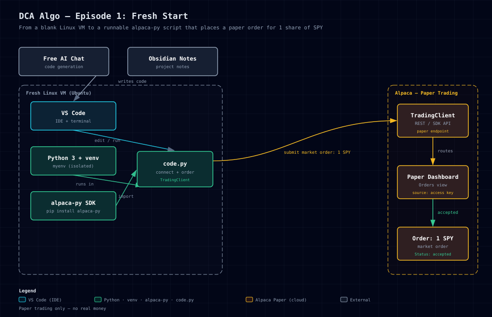

# EP01 — Fresh start: connect to Alpaca and place a paper order

**Video:** [How To Automate Your Trading With Zero Skills FOR FREE — EP 1](https://www.youtube.com/watch?v=LxnP1T3Ep0U)

## 🏗️ IT infrastructure (from the video)



> Interactive version: open [`ep01-architecture.html`](ep01-architecture.html) in a browser.
>
> **How to open the HTML diagram (no coding needed):**
> An `.html` file is just a web page saved on your computer. To view it:
> 1. **File explorer** — navigate to this folder, then **double-click** `ep01-architecture.html`. It opens in your default browser.
> 2. **Right-click** the file → *Open with* → choose any browser (Chrome, Firefox, Edge).
> 3. **From a terminal:** `xdg-open ep01-architecture.html` (Linux) or `open ep01-architecture.html` (Mac).
> 4. **Drag & drop** the file into an open browser window.
> The `.svg` above is the same diagram as a static image — the HTML one just lets you pan/zoom/interact.

## What this episode builds

A brand-new machine to the first runnable code: it connects to Alpaca (paper)
and submits a market order for **1 share of SPY**. In the video that order shows
up on the Alpaca paper dashboard as `accepted`. It's the "shitty foundation" —
by design. Each later episode replaces a bad habit (hardcoded keys → `.env`,
manual button click → scheduled, single order → DCA logic, etc.).

The video's code places a real **paper** order every time you run it, so
clicking "run" repeatedly fires **many SPY orders**. This folder's `code.py`
ships the safer default (connect + print account value, no order) so a curious
viewer doesn't accidentally submit orders. See `BUILD-STEPS.md` for both the
safe version and the faithful video version (which submits the order).

## Checkpoint

The video's final code connects to Alpaca (paper) and submits a market order
for 1 share of SPY. To run the safe default in this folder after completing
[SETUP.md](SETUP.md):

```bash
python code.py
```

To reproduce exactly what the video did (places a paper order), follow
`BUILD-STEPS.md` → "Run it — the VIDEO version".

## Files in this folder

- `code.py` — the runnable checkpoint (safe default: connect + print account value)
- `commands.md` — every command, in order
- `memories.md` — AI session summary of what we worked on
- `BUILD-STEPS.md` — full follow-along transcribed from the EP 1 video, with the safe (`.env`) code and the gotchas the video hits

## What the video deliberately does "wrong" (so you don't copy it)

The EP 1 video hardcodes the Alpaca API key/secret **directly in the code** (`API_KEY = "THE_KEY"`). That's an intentional teaching shortcut — the host calls it out as "making senior devs and cyber-security people mad." This folder's `code.py` does it the right way (keys in `.env`). Also: the video's script submits an order every time you run it, so clicking "run" repeatedly fires **many SPY orders**. See `BUILD-STEPS.md` for both the safe version and the faithful video version.
